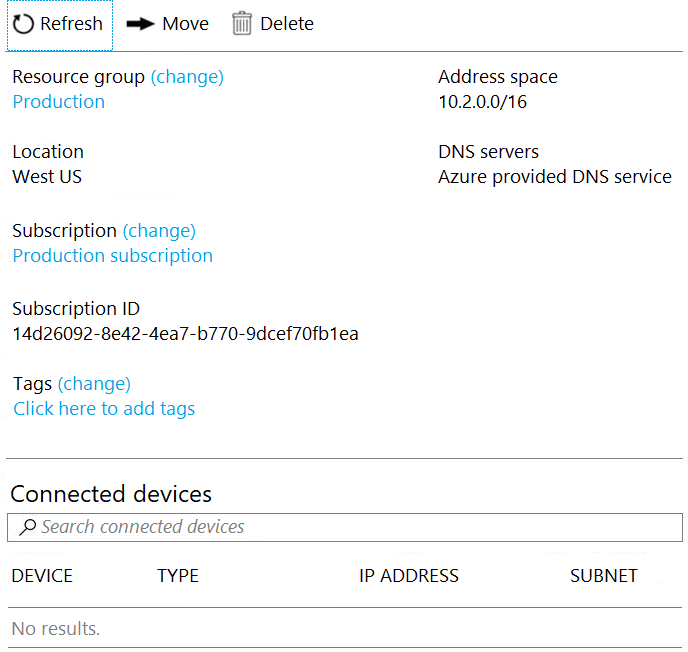

1. 
You have a virtual network named VNet1 as shown below

No devices are connected to VNet1. You plan to peer VNet1 to another virtual network named VNet2. VNet2 has an address space of 10.2.0.0/16.

You need to create the peering.
What should you do first?

- [ ] 1. Configure a service end point of Vnet2
- [ ] 2. Add a gateway of VNet1
- [ ] 3. Create a subnet in VNet1 and VNet2
- [x] 4. Modify the address space of Vnet1

    
Explanation

    

        Address spaces of virtual networks(VNet) must not overlap to enable VNet Peering. The IP address range for VNet1 and VNet2 are overlapping. Therefore, the first step is to modify the IP address range for VNet1.
git 
        https://docs.microsoft.com/en-us/azure/virtual-network/virtual-networks-faq#vnet-peering

        https://docs.microsoft.com/en-us/azure/virtual-network/virtual-network-manage-peering#requirements-and-constraints

        Incorrect Answers:

        Configure a service endpoint on VNet2 - Service endpoints provide secure and direct connectivity to Azure services over Azure backbone network.

        Add a gateway subnet to VNet1 - You need to create a gateway subnet for your VNet in order to configure a virtual network gateway. It is not required for Vnet peering.

        Create a subnet on VNEt1 and VNet2 - Subnets are not mandatory for VNet peering.
    

****

